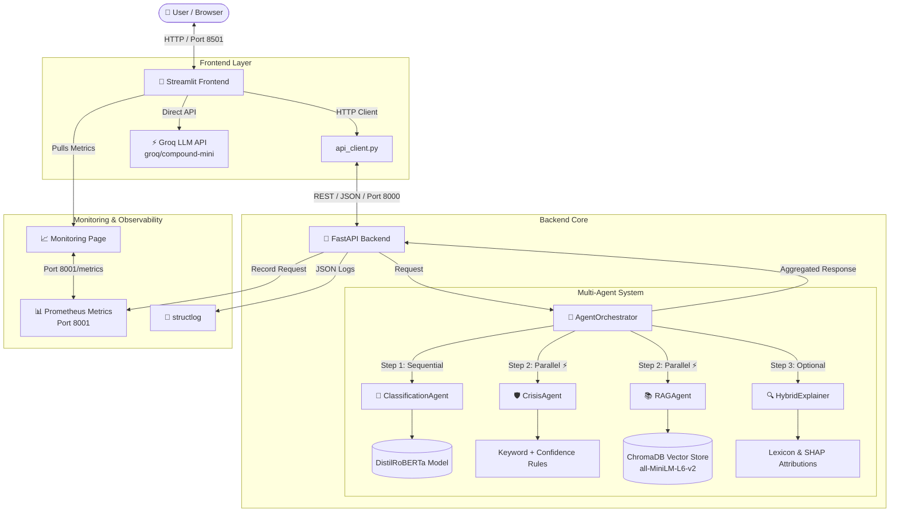

# 💙 Mental Health Agentic AI Platform

[](https://www.python.org/)
[](https://fastapi.tiangolo.com/)
[](https://streamlit.io/)
[](https://pytorch.org/)
[](https://groq.com/)
[](https://www.trychroma.com/)
[](https://huggingface.co/YDVJIYA/distilroberta-base-finetuned-emotion)
[](LICENSE)

> **End-to-end Agentic AI platform for mental health intelligence** — fine-tuned NLP, multi-agent orchestration, vector RAG, explainable AI, crisis safety guardrails, Prometheus observability, and streaming LLM support.

| | |
|---|---|
| **Author** | [Jiya Yadav (@JIYA-YDV)](https://github.com/JIYA-YDV) |
| **Live Demo (HF Space)** | [YDVJIYA/mental-health-ai-platform](https://huggingface.co/spaces/YDVJIYA/mental-health-ai-platform) |
| **Fine-tuned Model** | [YDVJIYA/distilroberta-base-finetuned-emotion](https://huggingface.co/YDVJIYA/distilroberta-base-finetuned-emotion) |
| **Repository** | [Mental-Health-Agentic-AI-Platform](https://github.com/JIYA-YDV/Mental-Health-Agentic-AI-Platform) |

---

## 📑 Table of Contents

- [Why This Project](#-why-this-project)
- [Two Deployment Modes](#-two-deployment-modes)
- [System Architecture](#-system-architecture)
- [Multi-Agent Execution Flow](#-multi-agent-execution-flow)
- [Key Features (Deep Dive)](#-key-features-deep-dive)
- [Tech Stack](#️-tech-stack)
- [Repository Structure](#-repository-structure)
- [Quickstart Guide](#-quickstart-guide)
- [Configuration Reference](#-configuration-reference)
- [API Documentation](#-api-documentation)
- [Frontend Guide](#-frontend-guide)
- [Observability & Metrics](#-observability--metrics)
- [Safety & Ethics](#️-safety--ethics)
- [Performance Snapshot](#-performance-snapshot)
- [Testing](#-testing)
- [Troubleshooting](#-troubleshooting)
- [Roadmap](#-roadmap)
- [Resume Highlights](#-resume-highlights)
- [Disclaimer](#️-disclaimer)
- [License & Credits](#-license--credits)

---

## 🎯 Why This Project

Most mental-health demos stop at “classify emotion → print a template reply.”

This platform is designed as a **systems engineering showcase**:

| Problem | How this platform addresses it |
|--------|--------------------------------|
| Black-box emotion models | Hybrid explainability (lexicon + optional SHAP) |
| Generic wellness tips | ChromaDB RAG + curated emotion fallbacks |
| Unsafe generative replies | Crisis agent + LLM bypass on high risk |
| Single-script demos | Multi-agent FastAPI backend + Streamlit UI |
| No ops story | Prometheus metrics + structlog + monitoring page |
| Hard to demo publicly | HuggingFace Space (lightweight) + local full-stack |

**Design principle:** *compassionate UX on the outside, production architecture on the inside.*

## 🧩 Two Deployment Modes

This repo intentionally ships **two complementary modes**:

### 1) HuggingFace Space — Public Demo
- Single-file / lightweight Streamlit experience
- Self-contained emotion model + Groq streaming
- Instant try-without-setup for recruiters and users
- Best for: discovery, demos, portfolio link

### 2) Local Full-Stack — Engineering Mode
- FastAPI multi-agent backend (`backend/`)
- Streamlit UI wired over HTTP (`frontend/app.py` + `api_client.py`)
- ChromaDB RAG, Prometheus, structured logging, SHAP/lexicon explainers
- Best for: architecture interviews, deep technical review

```
Public demo (HF)  →  “It works and looks great.”
Local full-stack  →  “Here’s how it’s engineered.”
```

## 🌟 System Architecture


# High-level request path
```
User text
   │
   ▼
Streamlit UI  ──POST /classify──►  FastAPI
                                   │
                                   ▼
                            AgentOrchestrator
                     ┌─────────────┼─────────────┐
                     ▼             ▼             ▼
            Classification   CrisisAgent     RAGAgent
                 Agent      (parallel)     (parallel)
                     │             │             │
                     └─────────────┼─────────────┘
                                   ▼
                         Optional HybridExplainer
                                   │
                                   ▼
                         Aggregated JSON response
                                   │
                                   ▼
Streamlit renders cards/tabs  +  Groq streams supportive reply
```
# 🤖 Multi-Agent Execution Flow

# Step 1 — Sequential (required)

ClassificationAgent

- Model: YDVJIYA/distilroberta-base-finetuned-emotion

- Output: primary emotion, confidence, full score distribution

- Blocks downstream agents until complete (emotion is needed by RAG/crisis logic)
  
# Step 2 — Parallel (latency optimized)

CrisisAgent

- Keyword scan over crisis phrases

- Emotion-confidence risk contribution

- Produces: is_crisis, risk_level, risk_score, indicators, resources

RAGAgent

- Embeds query with MiniLM

- Retrieves top-k wellness docs from ChromaDB

- Applies two-tier similarity policy

- Returns structured recommendation objects

# Step 3 — Optional

HybridExplainer

- lexicon (default, ~milliseconds)

- shap (opt-in, slower, model-attention based)

- Returns token weights + human-readable summary

Orchestrator responsibilities

- Coordinate async agent execution (asyncio.gather for parallel stage)

- Aggregate results into a single API response

- Preserve session metadata + processing latency

- Never let one optional component crash the full pipeline (where designed)
  
# ✨ Key Features (Deep Dive)

1) Fine-tuned Emotion Intelligence
   
- Transformer sequence classification (DistilRoBERTa)

- Multi-label score vector for all emotions

- Confidence-aware downstream risk logic

- Canonical lowercase emotion labels for UI consistency
(sadness, joy, love, anger, fear, surprise, …)

2) Vector RAG with Smart Fallbacks
   
- ChromaDB persistent collection

- Cosine similarity retrieval

- Threshold strategy:
  
    - Strict threshold (e.g. 0.40): high-confidence matches preferred
      
    - Fallback floor (e.g. 0.25): weak-but-usable matches still allowed
 
    - Below floor: empty RAG result → frontend emotion-curated fallback cards
      
- Recommendation payload includes:
  
  - title, content, relevance_score, category, source
  
3) Safety & Crisis Guardrails
   
- Multi-signal detection:

  - Crisis keyword matches
  - High-confidence distress emotions (e.g. sadness/fear)
    
- Risk levels: low | medium | high | critical
  
- Immediate resources surfaced (988 / 741741 / 911 / international links)

- UI + backend both enforce crisis-first messaging

- Groq generative response is suppressed on crisis path

4) Explainable AI (Hybrid XAI)

| Mode |	Speed |	What it shows |
|------|--------|---------------|
| Lexicon |	Very fast |	Curated emotional terms matched in text |
| SHAP |	Slower |	Model-attention style token attributions |

 UI shows:

- Highlighted tokens in original text
  
- Contribution bars

- Method disclosure (lexicon_attribution vs shap_gradient)
  
5) Streaming Supportive LLM Responses

- Provider: Groq

- Model: groq/compound-mini (post-deprecation migration from versatile-class models)

- Streaming tokens into Streamlit chat UI

- Prompt constraints:
  - short, empathetic, non-diagnostic
    
  - one practical suggestion
    
  - no medical claims / no therapy replacement language
    
6) Production-style Observability

- Prometheus metrics server (:8001)

- Request counters labeled by emotion + risk level

- Latency histogram

- Confidence histogram

- Crisis alert counters
  
- Streamlit Monitoring page for live visualization
  
# 🛠️ Tech Stack

Backend

| Layer |	Technologies |
|-------|--------------|
| API |	FastAPI, Uvicorn, Pydantic v2, pydantic-settings |
| Agents |	Custom async orchestrator + specialized agents  |
| NLP |	Transformers, Tokenizers, PyTorch |
| Embeddings / RAG |	sentence-transformers, ChromaDB |
| LLM client |	groq SDK (also used from frontend for streaming) |
| Logging |	structlog |
| Metrics |	prometheus_client |
| Config |	python-dotenv + Settings class |

Frontend

| Layer |	Technologies |
|-------|--------------|
| UI |	Streamlit multipage app |
| HTTP |	requests |
| Styling |	Custom dark-theme CSS |
| Pages |	Main analyzer + Monitoring dashboard |

Model artifacts

| Artifact |	Source |
|----------|---------|
| Emotion classifier |	HuggingFace: YDVJIYA/distilroberta-base-finetuned-emotion |
| Embeddings |	sentence-transformers/all-MiniLM-L6-v2 |
| LLM	| Groq-hosted groq/compound-mini |

# 📁 Repository Structure
```
Mental-Health-Agentic-AI-Platform/
├── backend/
│   ├── main.py                      # FastAPI app, lifespan, CORS
│   ├── agents/
│   │   ├── orchestrator.py          # Multi-agent coordinator
│   │   ├── classification_agent.py
│   │   ├── crisis_agent.py
│   │   ├── rag_agent.py
│   │   ├── wellness_agent.py
│   │   └── semantic_interpreter.py
│   ├── api/
│   │   ├── routes.py                # /health, /classify
│   │   ├── schemas.py               # Request/response contracts
│   │   └── middleware.py
│   ├── config/
│   │   └── settings.py              # Canonical configuration
│   ├── models/
│   │   ├── classifier.py            # DistilRoBERTa wrapper
│   │   ├── embeddings.py
│   │   ├── rag_pipeline.py          # ChromaDB retrieval
│   │   └── llm_responder.py         # Groq helper (backend path)
│   ├── explainability/
│   │   ├── explainer.py             # Lexicon attribution
│   │   ├── shap_explainer.py        # Optional SHAP path
│   │   └── hybrid_explainer.py      # Method router + fallback
│   └── monitoring/
│       ├── logger.py
│       └── metrics.py               # Prometheus instrumentation
│
├── frontend/
│   ├── app.py                       # Main Streamlit analyzer UI
│   ├── api_client.py                # Backend HTTP client + normalization
│   └── pages/
│       └── 1_Monitoring.py          # Live metrics dashboard
│
├── datasets/                        # Data / knowledge assets
├── evaluation/                      # Evaluation utilities
├── tests/                           # pytest suite
├── notebooks/                       # Experiments
├── deploy/ docker/ docs/            # Deployment & docs assets
├── .env.example                     # Sample environment variables
├── requirements.txt
└── README.md
```

# 🚀 Quickstart Guide

Prerequisites

- Python 3.11+

- Git

- Free Groq API key: https://console.groq.com

- (Optional) CUDA GPU — CPU works fine

# 1) Clone & install

git clone https://github.com/JIYA-YDV/Mental-Health-Agentic-AI-Platform.git
cd Mental-Health-Agentic-AI-Platform

python -m venv .venv

# Windows PowerShell
.\.venv\Scripts\Activate.ps1

# macOS / Linux

source .venv/bin/activate

pip install -r requirements.txt

# 2) Create .env (project root)

# ── Application 
DEBUG=false
LOG_LEVEL=INFO
HOST=0.0.0.0
PORT=8000

# ── Groq LLM 
GROQ_API_KEY=gsk_your_actual_key_here
GROQ_MODEL=groq/compound-mini

# ── Models 
EMOTION_MODEL=YDVJIYA/distilroberta-base-finetuned-emotion
EMBEDDING_MODEL=all-MiniLM-L6-v2
MAX_SEQUENCE_LENGTH=512

# ── RAG 
CHROMA_PERSIST_DIR=./chroma_db
TOP_K_RETRIEVAL=3
SIMILARITY_THRESHOLD=0.4

# ── Explainer 
EXPLAINER_DISPLAY_THRESHOLD=0.05
EXPLAINER_MIN_TOKENS=3
EXPLAINER_MAX_TOKENS=10

# ── Crisis

CRISIS_CONFIDENCE_THRESHOLD=0.75

# ── Monitoring 
ENABLE_METRICS=true
METRICS_PORT=8001

# ── Frontend 
BACKEND_URL=http://localhost:8000

# 3) Run full stack (2 terminals)

Terminal 1 — Backend

```
.\.venv\Scripts\Activate.ps1
python -m uvicorn backend.main:app --reload --port 8000
```
Wait for: Application startup complete.

# Terminal 2 — Frontend

```
.\.venv\Scripts\Activate.ps1
streamlit run frontend/app.py
```

# Access points

| Service |	URL |
|---------|-----|
| Streamlit UI |	http://localhost:8501 |
| Monitoring page |	Sidebar → Monitoring (or pages/1_Monitoring.py) |
| Swagger docs |	http://localhost:8000/docs |
| Health check |	http://localhost:8000/health |
| Prometheus metrics |	http://localhost:8001/metrics |

# First-run notes

- Emotion + embedding models download on first startup (network required)

- Subsequent boots are faster (local cache)

- ChromaDB initializes / persists under configured directory
  
# ⚙️ Configuration Reference

| Variable |	Default / Example |	Purpose |
|----------|--------------------|---------|
| GROQ_API_KEY |	gsk_...	| Enables streaming LLM responses |
| GROQ_MODEL |	groq/compound-mini |	Chat model ID |
| EMOTION_MODEL |	HF model id |	Classifier checkpoint |
| EMBEDDING_MODEL |	all-MiniLM-L6-v2 |	RAG embeddings |
| TOP_K_RETRIEVAL |	3	Max docs retrieved |
| SIMILARITY_THRESHOLD |	0.4	Strict RAG threshold |
| CRISIS_CONFIDENCE_THRESHOLD |	0.75	Emotion risk contribution gate |
| EXPLAINER_DISPLAY_THRESHOLD |	0.05	Min token weight shown |
| ENABLE_METRICS |	true |	Start Prometheus exporter |
| METRICS_PORT |	8001 |	Metrics bind port |
| BACKEND_URL |	http://localhost:8000 |	Frontend → API base URL |

All settings are centralized in backend/config/settings.py and overridable via .env.

# 📡 API Documentation

Interactive docs: http://localhost:8000/docs

- GET /health

  Liveness + model readiness probe.
  
  Example response
  
  ```JSON
  
  {
    "status": "healthy",
    "version": "1.0.0",
    "models_loaded": true,
    "timestamp": "2026-08-18T18:29:22.889085"
  }
  ```

# POST /classify

Main multi-agent analysis endpoint.

Request schema

| Field |	Type |	Required |	Description |
|-------|------|-----------|--------------|
| text |	string |	✅ |	User input (1–5000 chars) |
| include_explanations |	bool |	no |	Enable token attributions |
| explainer_method |	string | no |	"lexicon" (default) or "shap" |
| session_id |	string |	no |	Conversation / UI session id |

Request example
```JSON

{
  "text": "I can't stop worrying about my job interview tomorrow, my heart won't stop racing.",
  "include_explanations": true,
  "explainer_method": "lexicon",
  "session_id": "session_001"
}
```

Response example
```JSON

{
  "emotion": "fear",
  "emotion_display": "Fear / Anxiety",
  "confidence": 0.995,
  "all_predictions": [
    { "label": "fear", "score": 0.995 },
    { "label": "surprise", "score": 0.002 }
  ],
  "recommendations": [
    {
      "title": "When Positive and Negative Feelings Collide",
      "content": "It is common to feel competent yet stuck...",
      "relevance_score": 0.3525,
      "category": "mindfulness",
      "source": "Mental Health Knowledge Base"
    }
  ],
  "crisis_assessment": {
    "is_crisis": false,
    "risk_level": "medium",
    "risk_score": 0.3,
    "crisis_indicators": ["High confidence fear detected"],
    "immediate_resources": [
      "National Suicide Prevention Lifeline: Call or text 988",
      "Crisis Text Line: Text HOME to 741741"
    ]
  },
  "explanations": [
    { "token": "worrying", "weight": 0.85, "influence": "positive" },
    { "token": "racing", "weight": 0.75, "influence": "positive" }
  ],
  "explanation_summary": "The fear classification is primarily driven by: worrying, racing.",
  "explainer_method": "lexicon_attribution",
  "session_id": "session_001",
  "processing_time_ms": 461.2,
  "timestamp": "2026-08-19T00:00:00.000000",
  "model_version": "1.0.0"
}
```

# Typical status codes
| Code |	Meaning |
|------|----------|
| 200 |	Success |
| 422 |	Validation error (empty text, schema mismatch) |
| 500 |	Unexpected server error |
| 503 |	Model/service unavailable |

# 🖥️ Frontend Guide

Main app (frontend/app.py)

- Emotion analysis form + example prompts

- Backend health pills / offline degradation

- Results:
  
  - Emotion gradient card
 
  - Latency / risk / crisis / safety metrics
 
  - Tabs: Emotions · Recommendations · Explainability · Agent Trace · Raw API
 
  - Groq streaming support panel
    
Backend client (frontend/api_client.py)

- check_health()

- analyze(...)

- Session ID generation

- Response normalization for UI:
  
  - all_predictions → all_emotions
 
  - token → word
 
  - derived crisis_detected / override fields
 
  - emotion-based recommendation fallbacks
    
Monitoring page (frontend/pages/1_Monitoring.py)

- Streamlit multipage auto-discovery (no hard link required in app.py).

- Shows:

  - Total requests
 
  - Crisis alerts
 
  - Average latency
 
  - Average confidence
 
  - Emotion breakdown chart
 
  - Risk-level breakdown chart
 
  - Raw Prometheus text dump
  
- Optional explicit nav link from main app sidebar:

```Python

st.page_link("pages/1_Monitoring.py", label="📊 Live Monitoring")

```

# 📊 Observability & Metrics

- Prometheus endpoint

 ```
GET http://localhost:8001/metrics
```

- Core custom metrics

| Metric |	Type |	Labels / notes |
|--------|-------|-----------------|
| mh_platform_requests_total |	Counter |	emotion, risk_level |
| mh_platform_request_duration_ms |	Histogram	| latency buckets |
| mh_platform_crisis_alerts_total	| Counter |	crisis detections |
| mh_platform_confidence_score |	Histogram |	model confidence |
| mh_platform_active_sessions |	Gauge |	active sessions |

# Structured logs

structlog emits JSON events for:

- request received

- agent start/complete

- RAG fallback decisions

- explainer method completion

- errors with stack context (where configured)

# 🛡️ Safety & Ethics

- This system is intentionally conservative on risk:

  1. Detect crisis language + high-distress emotion signals
  
  2. Escalate UI messaging to emergency resources
  
  3. Suppress free-form generative advice on crisis path
  
  4. Disclose research-only scope in UI and docs

- What this system does not do

  - Medical diagnosis
  
  - Treatment prescription
  
  - Claim to replace therapists / clinicians
  
  - Guarantee crisis detection completeness

- If you are in crisis, contact local emergency services or:

  - US: call/text 988
  
  - US: text HOME to 741741
  
  - International resources via IASP directories

# 📈 Performance Snapshot

- Observed local CPU-oriented ranges (hardware dependent):

| Path |	Typical latency |
|------|------------------|
| Classification + crisis + RAG (no heavy explainer) |	~50–500 ms |
| With SHAP explanations enabled |	~1–3+ s |
| Health endpoint |	low milliseconds |
| First model load (cold start) |	several seconds |

- Optimizations used:

  - Parallel agent stage after classification
  
  - Lazy SHAP initialization
  
  - Cached model loading at app startup
  
  - Frontend streaming for LLM tokens (perceived responsiveness)

# 🧪 Testing

```Bash

# Activate venv first
pytest -q

# Optional coverage
pytest --cov=backend --cov-report=term-missing
```

# Manual smoke checklist 

 - GET /health → healthy + models_loaded=true
   
 - POST /classify normal sadness/fear/joy inputs
   
 - Crisis input triggers is_crisis=true + resources
   
 - Recommendations appear (RAG or curated fallback)
   
 - Lexicon explanations return tokens
   
 - SHAP mode works or cleanly falls back

 - Streamlit analyzes successfully against backend
   
 - Backend-down UI degrades gracefully
   
 - Monitoring page reads :8001/metrics

   
# 🧰 Troubleshooting

| Symptom |	Likely cause |	Fix |
|---------|--------------|------|
| GROQ_API_KEY not found |	.env not loaded / wrong path |	Put .env in project root; restart process |
| Backend 500 on /classify |	missing settings field / agent error |	Check uvicorn traceback; verify settings.py |
| Empty recommendations on joy/love |	weak RAG similarity |	Expected; curated fallbacks should fill UI |
| Empty explanations |	lexicon miss / high display threshold |	Lower EXPLAINER_DISPLAY_THRESHOLD; try richer emotional wording |
| Monitoring page missing |	pages folder not discovered |	Ensure frontend/pages/1_Monitoring.py; restart Streamlit |
| Streamlit duplicate element ID |	missing widget key= |	Add unique keys to toggles/radios |
| CORS errors in browser |	origin not allowed |	Confirm CORS includes http://localhost:8501 |
| Model download failures |	network / HF access |	Retry; check firewall; verify model id |


# 📌 Resume Highlights

- Engineered a multi-agent FastAPI orchestration system (sequential classification + parallel crisis/RAG), keeping end-to-end analysis in sub-second ranges on CPU for non-SHAP paths.
- Fine-tuned and productionized a DistilRoBERTa emotion classifier, published on HuggingFace, and integrated it into a real-time inference service.
- Built a RAG pipeline with ChromaDB + MiniLM embeddings, including two-tier similarity thresholds and curated fallback recommendations.
- Implemented safety-critical crisis detection combining keyword signals and confidence-aware risk scoring, with emergency resource routing and generative-response suppression.
- Delivered hybrid explainability (fast lexicon attributions + optional SHAP) and a polished Streamlit UX with agent-trace visualization.
- Added observability via Prometheus metrics, structured JSON logging, and a live monitoring dashboard.
  
# ⚖️ Disclaimer

- This platform is an AI research prototype and is not a clinical device, diagnostic service, or substitute for professional mental health care.

If you or someone else may be in danger, contact emergency services immediately or local crisis resources (in the US: 988, Crisis Text Line 741741).

# 📄 License & Credits

- License: See LICENSE

- Author: Jiya Yadav

- Model hosting: HuggingFace

- LLM inference: Groq

- Core libraries: FastAPI, Streamlit, PyTorch, Transformers, ChromaDB, Prometheus


<p align="center"> Built with care by <a href="https://github.com/JIYA-YDV">Jiya Yadav</a> for mental health awareness and responsible AI engineering.<br/> ⭐ If this project helps you learn or build, please star the repository. </p> 
