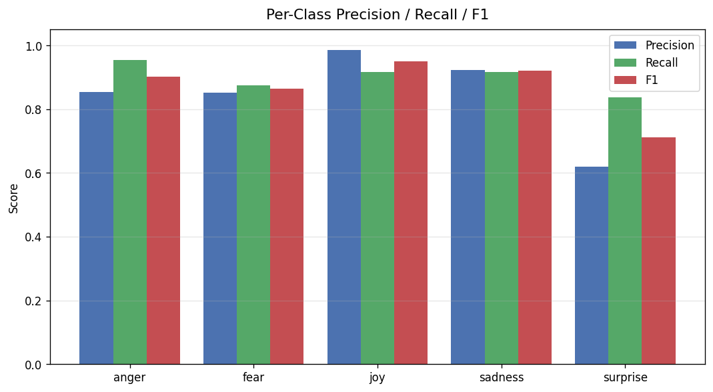
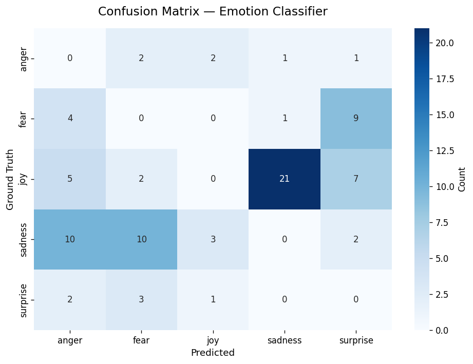

# 📊 Model Evaluation Report
> Auto-generated on **2026-06-29 16:04 UTC** by `evaluation/benchmark.py`.
> Re-run with: `python -m evaluation.benchmark --samples 1000`

---

## 🎯 Headline Metrics

| Metric | Value | Grade |
|--------|-------|-------|
| **Macro F1** | **0.869** | 🏆 Excellent |
| **Weighted F1** | **0.916** | |
| **Accuracy** | **0.914** | |
| **Sample Count** | 1000 | |

---

## 🧪 Methodology

- **Model:** `j-hartmann/emotion-english-distilroberta-base`
- **Dataset:** `dair-ai/emotion` (test split)
- **Sample size:** 1000 examples
- **Evaluation labels:** anger, fear, joy, sadness, surprise
- **Excluded labels:** `disgust`, `neutral` (not in dataset)
- **Label mapping:** `love` → `joy` (no direct dataset equivalent)
- **Random seed:** 42 (reproducible)

The evaluation uses **macro-averaged F1** as the headline metric to weight all emotion classes equally regardless of frequency.

---

## 📈 Per-Class Performance

| Emotion | Precision | Recall | F1 | Support |
|---------|-----------|--------|-----|---------|
| anger | 0.854 | 0.953 | 0.901 | 129 |
| fear | 0.852 | 0.875 | 0.863 | 112 |
| joy | 0.985 | 0.917 | 0.950 | 421 |
| sadness | 0.923 | 0.917 | 0.920 | 301 |
| surprise | 0.620 | 0.838 | 0.713 | 37 |

---

## 🧩 Confusion Matrix

**Most confused pair:** `joy` misclassified as `sadness` (21 times, 24.4% of all errors).

---

## 🚦 Crisis Detection Performance

A subset metric: how reliably does the model identify high-risk emotions (sadness + fear, often correlated with depression/anxiety)?

| Metric | Value |
|--------|-------|
| **Combined Sadness + Fear Recall** | 0.932 |
| **Combined Sadness + Fear Precision** | 0.930 |
| **False Negative Rate** | 0.068 |

> ⚠️ False negatives (missed crisis signals) are the most dangerous error type in mental health applications.

---

## 🔍 Reproducibility

Recreate this exact report:

    python -m evaluation.benchmark --samples 1000 --seed 42

View raw metrics:

    cat evaluation/results/metrics.json

Inspect sample predictions:

    head evaluation/results/predictions.csv

---

## 🛠️ Limitations

1. **Domain mismatch:** Twitter text differs from clinical/therapeutic text
2. **Label collapse:** `love` mapped to `joy` may inflate joy recall
3. **Excluded labels:** Model's `disgust` and `neutral` predictions on a 6-class dataset count as misclassifications by default
4. **Sample size:** 1000 samples gives ±3.1% margin at 95% confidence for accuracy metrics

---

## 📊 Next Steps

- [ ] Evaluate on domain-specific mental health corpus (e.g., DAIC-WOZ)
- [ ] Add temperature calibration for confidence scores
- [ ] Fine-tune on labeled mental health data (planned v1.2)
- [ ] Test against adversarial / paraphrased inputs

---

*Report generated by the Mental Health Agentic AI Platform evaluation harness.*
