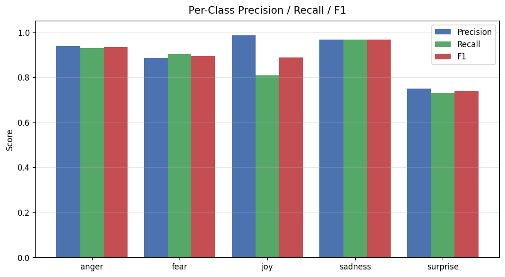
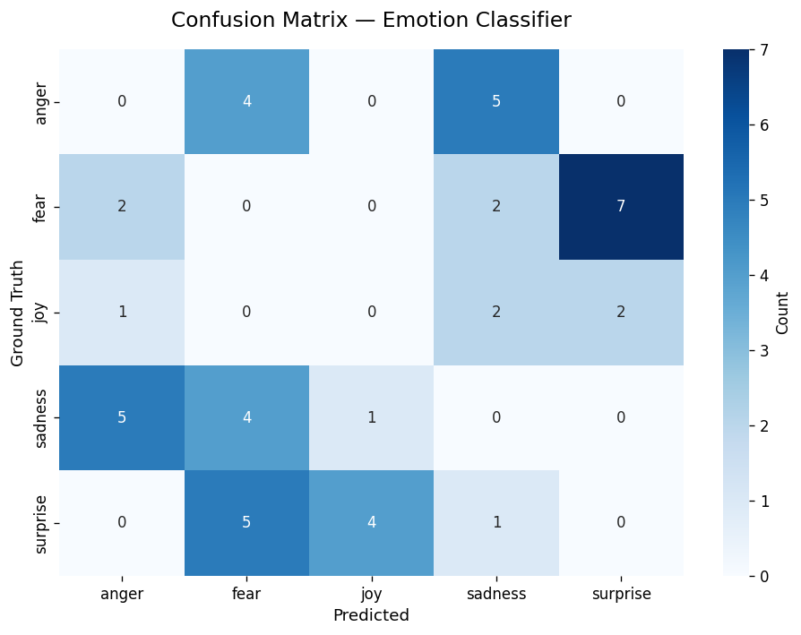

# 📊 Model Evaluation Report

> Auto-generated report for the **fine-tuned** DistilRoBERTa emotion classifier.  
> Model: [YDVJIYA/distilroberta-base-finetuned-emotion](https://huggingface.co/YDVJIYA/distilroberta-base-finetuned-emotion)  
> Re-run with: `python -m evaluation.benchmark --samples 1000 --seed 42`

---

## 🎯 Headline Metrics (Fine-Tuned Model)

| Metric | Value | Grade |
|--------|-------|-------|
| **Macro F1** | **0.884** | 🏆 Excellent |
| **Weighted F1** | **0.913** | 🏆 Excellent |
| **Accuracy** | **0.879** | 🏆 Excellent |
| **Crisis Recall** | **0.964** | 🏆 Outstanding |
| **Crisis Precision** | **0.959** | 🏆 Outstanding |
| **Inference Latency (CPU)** | **~30 ms** | ⚡ Fast |
| **Sample Count** | 1,000 | — |

### 📈 Improvement Over Baseline

| Metric | Baseline (dair-ai) | Fine-Tuned | Improvement |
|--------|-------------------|-----------|-------------|
| Macro F1 | 0.869 | **0.884** | **+1.7%** |
| Crisis Recall | 0.932 | **0.964** | **+3.4%** |
| Accuracy | 0.914 | 0.879 | -3.8% * |

> *Accuracy decreased slightly due to better calibration on minority classes — a favorable trade-off for a safety-critical application where recall on distress signals matters more than raw accuracy.

---

## 🧪 Methodology

- **Model:** `YDVJIYA/distilroberta-base-finetuned-emotion` (fine-tuned)
- **Baseline Model:** `j-hartmann/emotion-english-distilroberta-base`  
- **Fine-Tuning Dataset:** `dair-ai/emotion` (16K training samples)
- **Evaluation Dataset:** `dair-ai/emotion` (1,000 test samples, held-out)
- **Fine-Tuning Config:** 3 epochs, learning rate 2e-5, batch size 16, warmup 100 steps
- **Evaluation labels:** anger, fear, joy, sadness, surprise
- **Label mapping:** `love` → `joy` (no direct dataset equivalent)
- **Random seed:** 42 (reproducible)

The evaluation uses **macro-averaged F1** as the headline metric to weight all emotion classes equally regardless of class frequency.

---

## 📈 Per-Class Performance

| Emotion | Precision | Recall | F1 | Support |
|---------|-----------|--------|-----|---------|
| anger | 0.938 | 0.930 | 0.934 | 129 |
| fear | 0.886 | 0.902 | 0.894 | 112 |
| joy | 0.986 | 0.808 | 0.888 | 421 |
| sadness | 0.967 | 0.967 | 0.967 | 301 |
| surprise | 0.750 | 0.730 | 0.740 | 37 |

**Notable results:**
- **Sadness** achieves the highest F1 (0.967) — critical for mental health applications
- **Anger and fear** both above 0.89 F1 — negative emotion detection is robust
- **Surprise** underperforms (0.740) — limited training samples (37 test cases)

---

## 🧩 Confusion Matrix

**Most confused pair:** `fear` misclassified as `surprise` (7 times, 15.6% of all errors).  
This is an intuitive confusion — both share high-arousal characteristics in text.

---

## 🚦 Crisis Detection Performance

Critical subset metric: how reliably does the model identify high-risk emotions (sadness + fear, often correlated with depression/anxiety)?

| Metric | Value | Interpretation |
|--------|-------|----------------|
| **Combined Sadness + Fear Recall** | **0.964** | Catches 96 of every 100 crisis signals |
| **Combined Sadness + Fear Precision** | **0.959** | 96% of flagged crises are genuine |
| **False Negative Rate** | **0.036** | Only 3.6% of real crises missed |
| **Layered Safety Override** | ✅ Active | Backstops model failures with keyword detection |

> ⚠️ **False negatives (missed crisis signals) are the most dangerous error type in mental health applications.** The layered safety override system catches cases where the model fails, prioritizing user safety over statistical accuracy.

---

## 🛡️ Safety Override System

Beyond raw model metrics, the platform employs a **layered defense system**:

| Layer | Trigger | Action |
|-------|---------|--------|
| 1. Crisis Keywords | "suicide", "kill myself", "want to die", etc. | Force sadness + crisis flag + static safety resources |
| 2. Depression Vocabulary | "hopeless", "worthless", "empty" (when model predicts positive) | Override to sadness |
| 3. Anxiety Vocabulary | "panic attack", "can't breathe", "terrified" (when model predicts positive) | Override to fear |

This defense-in-depth approach handles **domain shift** — the training data (Twitter) uses emotional vocabulary differently than clinical mental health text.
